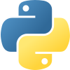
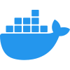

## Hi there 👋

I build data, AI, and platform systems with a focus on reliable application development, deployment automation, and machine learning workflows.

### Core stack

### Platform & data

### AI & observability

### Areas of focus

- Backend services and API design
- Cloud-native deployment and platform automation
- Data integration and analytics workflows
- LLM application development and experimentation
- Monitoring, reliability, and operational tooling
